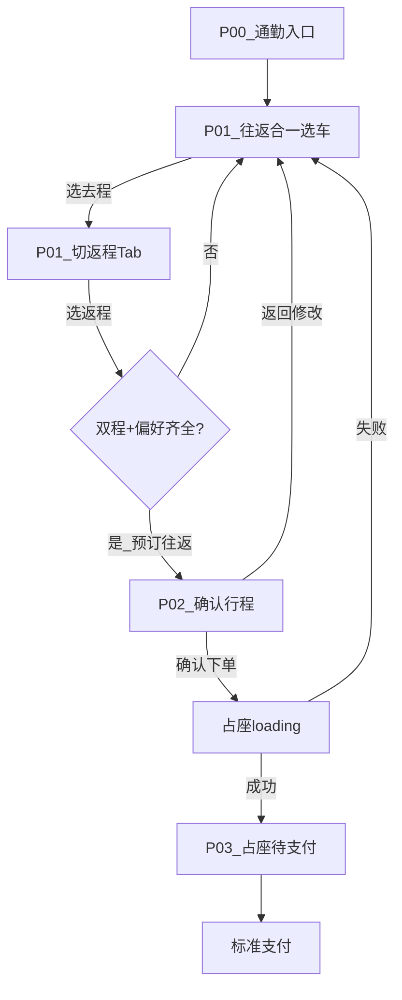

# 通勤购票 交互说明 — v1.0 最终版 / 2026-05-28

> 视觉与交互原型：[wireframes/commute-ticket-booking-preview.html](../wireframes/commute-ticket-booking-preview.html)  
> 打开后默认「**交互演示**」，在单台手机内点击走通 P00→P01→P02→P03  
> 示意图：`wireframes/previews/P01-outbound-select.png` · `P01R-return-select.png` · `P02-confirm-trip.png` · `P03-occupy-bw.png`

## 元信息

| 项 | 值 |
|----|-----|
| 产品 | 火车票 · 通勤购票（高粘性用户 · 临近发车） |
| 版本 | **v1.0 最终版** |
| 日期 | 2026-05-28 |
| 平台 | 移动端 H5 · 375 · Ctrip UI Kit @1x |
| 范围 | P00–P03 主路径 + P01 半屏侧链 + 加载/空/错态 + 占座异常 |

## 视觉约定

- 默认灰度：design-spec §9.1
- **高亮**：「有票」`#00B87A` · 占座倒计时 `#111111` 加粗
- Button-Booking：`#3263A6` / `#FFFFFF`；disabled `#AAAAAA`
- Tabs：`checkedColor=blue`

---

## 设计原则（已落地）

| 原则 | 实现 |
|------|------|
| 低门槛 | 坐席+乘车人顶部快捷条，一次设置往返通用；默认带出上次偏好 |
| 不阻断主路径 | 首访 Tips 可关；无 Dialog 引导；列表始终可操作 |
| 往返合一 | 同页 Tab 切换去/返，底栏一次「预订往返」 |
| 下单前确认 | **保留 P02**，双程卡片 + 返回修改 + 分段修改 |
| 临近发车 | 「离发车 N 分」「曾经买过」Tag；默认「有票方案」筛选 |

---

## 用户流程 F01：主路径

| 步骤 | 页面 | 用户动作 | 系统响应 |
|------|------|----------|----------|
| 1 | P00 | 点击通勤入口 / 查询 | navigate P01 |
| 2 | P01 | 确认/改坐席、乘车人（半屏） | 回写快捷条；列表不刷新 |
| 3 | P01 | 点去程车次 | 选中 + 自动切返程 Tab + Toast |
| 4 | P01 | 点返程车次 | 选中 + 底栏激活「预订往返」 |
| 5 | P01 | 预订往返 | navigate P02（行程快照） |
| 6 | P02 | 确认下单 | loading 占座 → P03 |
| 7 | P03 | 去支付 | 跳转标准支付 |

---

## 产品决策（原 TBD 已关闭）

| 议题 | 决策 |
|------|------|
| 是否跳过 P02 | **否**，始终展示确认页 |
| 双程占座部分失败 | **全部取消**已占座位，Toast 原因，回 P01；**保留**坐席/乘车人，**清空**车次选中 |
| 站点/日期变更 | 确定后 **清空去返车次**，刷新列表，Toast「请重新选择车次」 |
| 未登录拦截 | P00 点击入口时拦截 → 登录页 `returnUrl=/commute/select` |
| P03 返回键 | **禁止**；尝试返回 → Dialog「占座未完成，确定离开？」 |
| 占座超时 | 30s 无结果 → Dialog「继续等待 / 返回修改」 |
| 多日通勤 | v1 默认**当日往返**；返程日期 ≥ 去程，不等则 Toast 拦截 |
| 乘车人上限 | 单次 5 人（v1 演示 1 人） |

---

## 导航与路由

| 路由 | 页面 | 参数 |
|------|------|------|
| `/train/home` | P00 | — |
| `/commute/select` | P01 | `restoreState` 可选 |
| `/commute/confirm` | P02 | `orderDraftId` |
| `/commute/occupy` | P03 | `orderId` |
| `/order/pay` | P04 | 复用标准 |

**状态保留**：P02→P01 返回带完整 state（去返车次、Tab、偏好）。

---

## 屏幕状态矩阵

| 页面 | 默认 | 加载 | 空 | 错误 |
|------|------|------|-----|------|
| P00 | ✓ | — | — | — |
| P01 | ✓ | Skeleton 3–5 行 | Empty States inPage | Empty+重试 |
| P02 | ✓ | 占座 loading | — | Toast 停留 |
| P03 | ✓ | 进入前 loading | — | 回 P01/P02 |

---

## P01 往返车次选择（M-COMMUTE）

### 区块表

| 区块 | UI Kit | 说明 |
|------|--------|------|
| Tips | Tips info | 首访可关；非首访且偏好齐全则不展示 |
| 路线条 | 搜索 | 半屏改 OD+日期 |
| 快捷条 | Form-Group | 坐席 + 乘车人 |
| 去/返 Tab | Tabs | 副标题展示选中车次 |
| 日期/筛选 | 日期选择横滑 + Switch-Filter Chip | |
| 列表 | 车次结果卡 | 单选；选中黑框 |
| 底栏 | Bottom Bar-Action | 合计 + Button-Booking |

### 交互表

| ID | 组件 | 触发 | 条件 | 动作 | 目标 | 反馈 |
|----|------|------|------|------|------|------|
| P01-I01 | Title Bar 返回 | click | — | navigate | P00 | — |
| P01-I02 | Tips × | click | 首访 | dismiss | — | 写 localStorage |
| P01-I03 | 路线条 | click | — | open | Half Screen 站点日期 | — |
| P01-I04 | 坐席行 | click | — | open | Half Screen 坐席 | — |
| P01-I05 | 乘车人行 | click | — | open | Half Screen 乘车人 | — |
| P01-I06 | Tab 去程/返程 | click | — | switch_tab | 列表区 | 保留另一程选中 |
| P01-I07 | 车次结果卡 | click | 当前 Tab | select | 写入 state | 去程选完→切返程+Toast |
| P01-I08 | 站点日期确定 | click | 合法 | refresh | 清空车次+拉列表 | Toast |
| P01-I09 | Button-Booking | click | 双程+偏好 | navigate | P02 | — |
| P01-I09 | Button-Booking | — | 不满足 | — | — | disabled |
| P01-I10 | route_enter | — | — | api_call | 列表+档案 | Skeleton |

### 半屏 P01-S02 坐席

| ID | 组件 | 动作 |
|----|------|------|
| S02-I01 | Single Selection-Radio Tag | 选二等/一等/商务/无座 |
| S02-I02 | Button-Booking 确定 | close + 回写快捷条 |

### 半屏 P01-S03 乘车人

| ID | 组件 | 动作 |
|----|------|------|
| S03-I01 | Multiple Selection-Checkbox Cell | 勾选 ≥1 |
| S03-I02 | Button-Booking 确定 | close；未选则 CTA disabled |

---

## P02 行程确认

| ID | 组件 | 触发 | 动作 | 目标 | 反馈 |
|----|------|------|------|------|------|
| P02-I01 | 返回 / 返回修改 | click | navigate | P01 restoreState | — |
| P02-I02 | 卡片「修改」 | click | navigate | P01 对应 Tab | — |
| P02-I03 | 确认下单 | click | api_call 占座 | P03 | loading 1.5s |
| P02-I04 | 确认下单 | fail | navigate | P01 | Toast；清空车次 |

**文案**：Tips「两程将一起占座；若一程失败，已占座位将全部释放」

---

## P03 占座待支付（M-OCCUPY）

| ID | 组件 | 触发 | 动作 | 反馈 |
|----|------|------|------|------|
| P03-I01 | route_enter | — | 展示双程大单卡+倒计时 | — |
| P03-I02 | 去支付 | click | navigate | 标准支付 |
| P03-I03 | 取消订单 | click | Dialog 确认 | 回 P01 |
| P03-I04 | 系统返回 | click | Dialog | 阻止离开 |

---

## 新功能引导策略

| 状态 | UI | 规则 |
|------|-----|------|
| 首访 | Tips info + 可关 | 不弹 Dialog |
| 偏好已齐 | 无 Tips | 直接选车 |
| 缺乘车人 | Tips warning | 不挡列表，挡 CTA |

---

## 异常摘要

| 场景 | 处理 |
|------|------|
| 未登录 | P00 → 登录 → 回 P01 |
| 无车次 | Empty + 改筛选 |
| 占座余票不足 | Toast → P01，保留偏好 |
| 占座其他失败 | Toast → P02 可重试 |
| 网络失败 | 列表错误态 + 重试 |

---

## 交付自检

- [x] HTML 可交互走通主路径
- [x] GenerateImage previews 已生成
- [x] 灰度为主；有票高亮已标注
- [x] M-COMMUTE / M-OCCUPY 模式
- [x] UI Kit 组件名一致
- [x] TBD 已全部决策关闭
